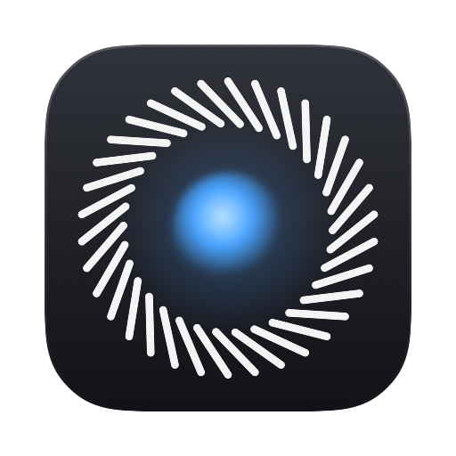
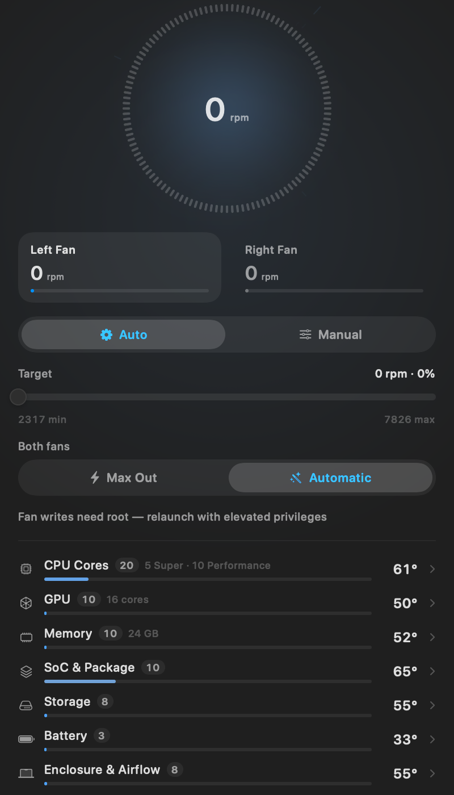
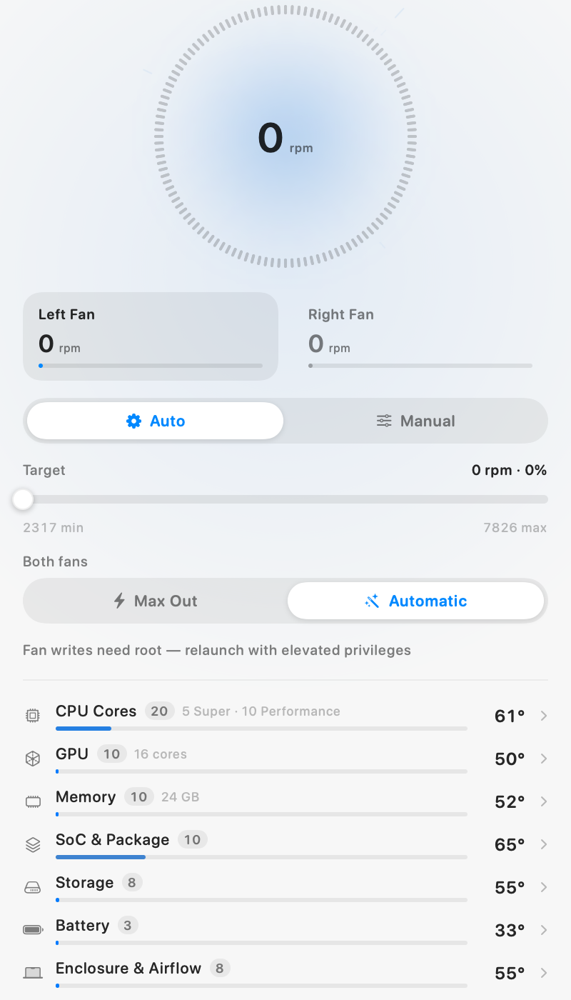
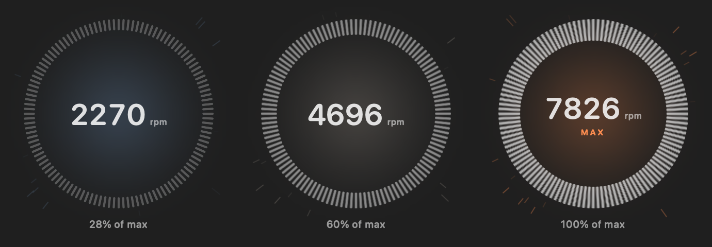
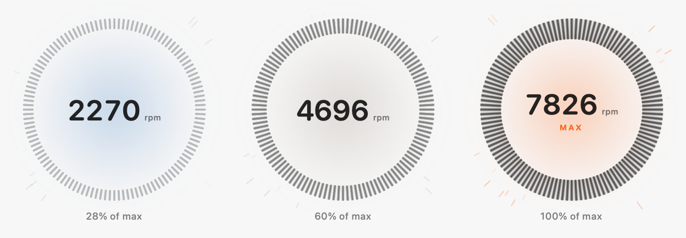

# SiliCool

A menu bar fan and thermal monitor for Apple silicon. It reads the SMC directly,
groups every sensor the machine will admit to into something readable, and lets
you take a fan off the system governor and hold it where you want it — or slam
it to its ceiling.

**Everything shown is measured.** There is no simulation, no sample data and no
placeholder readings: if the SMC cannot be reached the panel says so and shows
nothing. Where a published key table and this machine disagree, the machine
wins.

<p align="center">
  <br>
  
  
</p>

There is a [product page](site/index.html) with a live gauge and the measured
sensor tables, published from `site/`.

It lives in the menu bar (`LSUIElement`, no Dock icon, no window). The menu bar
item shows the fastest fan's current rpm, and the icon fills in while SiliCool
is the one holding a fan there. The panel is a fixed 400 × 760: name and Quit at
the top, the gauge, the controls, and the sensor list taking whatever is left.

Fan mode (Auto / Manual) and the presets (Max Out / Automatic, applied to both
fans) are segmented pills. Dragging the speed slider switches the fan to Manual
on its own — the selector says so from the first pixel of the drag, and the SMC
write lands once on release rather than once per frame.

## The gauge




Every bar is identical — same length, same width, same colour. Two things track
fan speed and nothing else does:

- **Length.** All bars reach inward together, from 5% of the radius at rest to
  21% at full tilt. The cap is what keeps the readout clear of them at any speed.
- **Brightness.** Bar opacity *is* the fan's percentage of its ceiling: at 29%
  the bars sit at 29% — grey — and only reach full white at 100%. There is a
  floor of 0.22 so a fan idling at its 30% minimum is still legible.

Rotation carries the sense of movement, mapped from measured rpm onto a readable
0.06–0.85 rev/s, because a literal 7,800 rpm would just strobe. `SpinClock`
integrates rotation over time and eases between speeds, so the ring keeps its
angle when the rpm changes instead of jumping.

The whole animation is one `TimelineView` driving one `Canvas`: the 120 bars are
a single stroked `Path`, and the heat streaks are four more — bucketed by fade,
their positions a pure function of time and index, so nothing is allocated or
kept between frames. With the panel closed the menu bar app sits at 0% CPU and
~76 MB resident.

## Colour

One accent, derived from thermal load, over the system's own materials —
everything else is `Color.primary` / `.secondary`, so the panel follows the
system appearance in light and dark with no second palette to maintain.

The heat ramp runs through Apple's system colours, and deliberately passes
through neutral grey rather than blending blue straight into orange, since that
midpoint is an olive mud:

| Load | Colour | Reads as |
| --- | --- | --- |
| 0.0 | systemBlue | cool |
| 0.5 | systemGray | normal |
| 0.8 | systemOrange | working |
| 1.0 | systemRed | hot |

Thermal load maps 55 °C → 0 and 105 °C → 1. Apple silicon idles warm and cruises
in the seventies, so a busy machine still reads as calm rather than alarming.

Controls use `Color.accentColor` — whatever the user picked in System Settings —
so the heat ramp only ever means temperature.

## Sensors


This Mac exposes ~3,500 SMC keys, 256 of which report a plausible temperature.
Apple has never documented any of them, so the naming here comes from the two
projects that maintain real reverse-engineered tables:

- [`dkorunic/iSMC`](https://github.com/dkorunic/iSMC/blob/master/src/temp.txt) —
  derived from per-chip hardware dumps plus a stress-and-correlate pass
- [`exelban/stats`](https://github.com/exelban/stats/blob/master/Modules/Sensors/values.swift) —
  community-curated, bucketed by chip generation

They disagree in places — all of M3's `Tf*`, M2 efficiency cores, M4 cores past
the fourth — and even where they agree, **the key tables describe whichever
machine was dumped, not yours.** The published M5 list has six first-tier and
twelve second-tier CPU keys, which is an M5 *Max*; an M5 Pro has five and ten.

So the tables are used only for the *ordering* of slots. Everything else is
asked of the machine at launch (`HardwareInventory`):

| Fact | Source | This Mac |
| --- | --- | --- |
| CPU tiers and core counts | `hw.perflevelN.name` / `.physicalcpu` | 5 Super · 10 Performance = 15 |
| GPU cores | IORegistry `AGXAccelerator` → `gpu-core-count` | 16 |
| Memory | `hw.memsize` | 24 GB |
| Model | `hw.model` | Mac17,9 |

Those counts gate the naming: a family is only described as cores when there is
exactly one probe per core the hardware reports. 42 `Tg` keys against 16 GPU
cores means they stay "GPU Probe". The CPU tiers read:

```
hw.perflevel0.name = "Super"        hw.perflevel0.physicalcpu = 5
hw.perflevel1.name = "Performance"  hw.perflevel1.physicalcpu = 10
hw.physicalcpu     = 15
```

Each tier gets exactly as many core labels as the OS reports cores; every slot
past that is labelled a cluster probe, not a core. The same caution applies to
the other families — this Mac has 16 GPU cores but 42 `Tg` keys, so those are
"GPU Probe *n*", not "GPU *n*".

| Group | Keys | Named as |
| --- | --- | --- |
| CPU Cores | `Tp…` | Super Core 1–5, Performance Core 1–10, CPU Cluster Probe *n* |
| GPU | `Tg…`, `TfC…` | GPU Probe 1–42, GPU Fabric 1–12 |
| Memory | `Tm…` | Memory Probe 1–40 |
| SoC & Package | `TCMb`, `TD…`, `TN…`, `TU…` | CPU Die Average, SoC Diode *n*, Package *n*, Uncore Die *n* |
| Storage | `Ts…`, `TH…`, `TS0P` | SSD Die 1–11, SSD Controller, SSD Drive A/B, NAND Max |
| Battery | `TB…` | Battery, Battery Thermistor 1/2 |
| Enclosure & Airflow | `Ta…`, `TAOL`, `TW0P`, `TCHP` | Airflow Left/Right, Ambient Outside Lid, Wi-Fi, Charger Proximity |
| Power Delivery | `TP…`, `TR…`, `TV…`, `TMVR` | Power Delivery *n*, RF Delivery *n*, Memory Voltage Regulator |

Three things the sources warn about, all handled:

- **The same key means different things on Intel and Apple silicon.** `Ts*` is
  palm-rest skin on Intel but SSD dies here; `Tm*` is mainboard on Intel but
  memory here. Getting this wrong is how `Ts*` ended up mislabelled as "SoC
  Blocks" in an earlier version of this app.
- **`TCHP` is contested.** One table calls it CPU Heatpipe; Apple's own firmware
  description string says charger proximity. This Mac reads it ~15 °C below the
  CPU die, which fits the charger, so that is what it is called.
- **Probe counts are not part counts.** 23 `Tp` keys on a 15-core chip, 42 `Tg`
  keys on a 16-core GPU. Naming them sequentially as cores invents hardware; the
  CPU group shows the real topology (`5 Super · 10 Performance`) beside its
  probe count.
- **Duplicate keys are found by measurement, not by list.** Some keys are several
  views of one register. Rather than hardcoding which, discovery sweeps every
  candidate three times a second apart and folds away same-family keys that are
  bit-identical in every sweep — which finds `Ta00 Ta04 Ta08 Ta0K Ta0O Ta0R` on
  this Mac exactly as the published note claims, without taking its word for it.
  The survivor is labelled `×6` so the reading is not silently standing in for
  others. Only groups of three or more are folded: two same-family probes can
  legitimately agree for a while — this Mac's `TB0T` and `TB2T` battery
  thermistors do — and losing a real sensor is worse than showing a redundant
  one.

  A tempting shortcut that does **not** work: dropping keys that never change.
  Measured over 1.2 s, 24 keys held perfectly constant, including the battery
  and every SoC diode. They are simply slow.

Anything not confidently known keeps its raw key — `TDBP`, `TaLW`, `TVA0` and
friends — because inventing a part name for them would be worse than showing the
key. Ordinals are numbered against the whole live family at discovery, so
"GPU 42" means the 42nd of 42 even though only a dozen are polled.

**The order never changes.** Groups run in a fixed sequence and probes are sorted
by key, not by temperature — a list that re-sorts itself while you read it is
useless.

## Fan curves

A curve holds the fans where you want them as temperature moves, instead of one
fixed speed. Four fixed anchors — 50, 65, 80, 95 °C — with a draggable height at
each: enough to shape the response, few enough to edit in a 370pt panel with
nothing to add, delete or mis-order. Quiet, Balanced and Aggressive presets are
a tap away, and the dashed marker shows where the machine is on your curve right
now.

The curve maps across the fan's **usable range**, not its ceiling. This Mac idles
at 2317 of 7826 rpm, so a curve measured against the ceiling would spend its
whole lower half clamped to the floor and do nothing. It writes only when the
answer has actually moved by more than 120 rpm, so a stable machine produces no
SMC traffic at all.

## History

Ten minutes at 1 Hz, in a ring buffer that is allocated once and never grows:
600 slots of six `Float`s is **14,400 bytes** for the entire window. Nothing is
appended, copied or re-sorted per sample, and the chart reads it back through a
subscript that allocates nothing. The trace is fixed to a 40–100 °C window so a
calm stretch cannot silently rescale itself into a spike.

## Memory

The app's footprint, measured with `task_vm_info.phys_footprint` — the number
Activity Monitor's Memory column shows:

| State | Footprint |
| --- | --- |
| Menu bar only, panel closed | **15 MB** |
| Panel open, gauge still | **~31 MB** |
| Panel open, gauge animating | **~104 MB** |

The gauge is a Metal-backed `Canvas`, and a live one costs about 90 MB of
backing store. Three things worth knowing about that number:

- **It is not a leak.** It plateaus within 10 seconds and then holds flat —
  measured at 104.0 / 104.1 / 104.2 / 104.2 / 104.2 MB across 50 seconds.
- **It is not frame-count driven.** Capping the gauge at 30 fps moved it by 5 MB
  (110.7 → 105.8), which is why the cap is there for energy rather than memory.
- **It is only paid while you are looking.** The gauge pauses when the panel
  closes, so the steady state is the 15 MB row. Earlier builds kept animating
  behind a shut panel and held the full cost indefinitely.

Visibility is asked of the window server (`NSApplication.occlusionState`), not
inferred from `onAppear`. SwiftUI sometimes builds a `MenuBarExtra`'s content
without ever showing it — about one launch in three here — and an `onAppear`
signal believes it, which left the gauge animating behind a closed panel at
120 MB. With occlusion state, five consecutive launches measured
15.0 / 15.1 / 15.0 / 15.0 / 15.0 MB.

Settings has an **Animate the gauge** switch for anyone who would rather not pay
it at all, and the system's Reduce Motion setting turns it off automatically.

## Fan control, and giving it back

Writing SMC fan keys requires root. Rather than making you launch the whole GUI
under `sudo`, SiliCool does what Macs Fan Control and Stats do: it installs a
small **launchd daemon** that owns the privileged writes, and talks to it over
XPC. You approve it once; after that a normal double-click can drive the fans.

```
SiliCool.app/Contents/
├── MacOS/
│   ├── SiliCool            ← the app. Never privileged. Reads sensors directly.
│   └── SiliCoolHelper      ← the daemon. Root, ~150 lines, Foundation + IOKit only.
└── Library/LaunchDaemons/
    └── Nikunj.SiliCool.Helper.plist
```

The privileged surface is four calls — `setTarget`, `setAutomatic`,
`restoreAll`, `version` — and nothing else. Reads need no privileges and never
cross the boundary.

### Installing it

Press **Enable Fan Control** in the panel. That calls
`SMAppService.daemon(plistName:).register()`, and macOS puts SiliCool in
**System Settings › General › Login Items & Extensions** with its switch off.
Turn it on — that is the admin-authenticated step — and control is live. It is
once-only: approval survives reboots, app updates, and unregister/re-register.

`SMJobBless` is the old way of doing this and was deprecated in macOS 13;
`SMAppService` is current. Two details that fail silently if you get them wrong:

- **`plistName` includes the `.plist` extension.** Unlike SMJobBless, which took
  a bare label. Omitting it gives "Error 108, unable to read plist".
- **No `SMPrivilegedExecutables` or `SMAuthorizedClients`.** Those are
  SMJobBless-only keys, and leaving them in is itself a documented cause of
  Error 108.

Note that `status` returns `.notFound` before the first registration whether or
not the plist is correctly installed — verified here by asking for a plist name
that does not exist and getting the identical answer. So it cannot be used to
check your wiring; only `register()` tells you.

### Both ends check each other

The daemon accepts a connection only from a binary matching a hard-coded
requirement, and the app demands the same of the daemon:

```
anchor apple generic
and certificate leaf[subject.OU] = "72B76SWRDS"
and (certificate leaf[field.1.2.840.113635.100.6.1.13]      /* Developer ID */
     or certificate leaf[field.1.2.840.113635.100.6.1.12])  /* Apple Development */
and (certificate 1[field.1.2.840.113635.100.6.2.6]
     or certificate 1[field.1.2.840.113635.100.6.2.1])
```

Applied with `setCodeSigningRequirement`, once, before `resume()` — it is a
fatal error in Swift to pass a malformed string or to call it twice. This is a
static signature check and replaces the older audit-token dance. Both binaries
were verified against this exact string with `codesign -R`.

**This requires real signing.** Ad-hoc (`codesign -s -`) cannot work: it carries
no Team ID for the requirement to match, and gives no stable code identity
across builds, so approvals would not stick. An Apple Development certificate is
enough.

### Giving the fans back

A pinned fan stays pinned until something un-pins it, so every exit path hands
them back — see `ShutdownGuard`. With the daemon in play the restore is a
blocking XPC round trip, because a signal handler has no later run loop turn in
which an async reply could land.

**Remove helper** in the panel resets the fans to automatic and unregisters the
daemon. Use it before deleting the app: deleting the bundle removes the daemon
and its plist (SMJobBless used to orphan files in `/Library/PrivilegedHelperTools`;
SMAppService does not), but the Login Items entry can survive as a known macOS
wart.

### Still works as root

`sudo path/to/SiliCool.app/Contents/MacOS/SiliCool` continues to work and skips
the daemon entirely — the app writes to the SMC directly when it is already
root. Useful for testing without touching Background Task Management.

## Building

Open `SiliCool.xcodeproj` and run, or:

```bash
DEVELOPER_DIR=/Applications/Xcode.app/Contents/Developer xcodebuild -project SiliCool.xcodeproj -scheme SiliCool -configuration Debug build
```

**The App Sandbox is off** (`ENABLE_APP_SANDBOX = NO`). A sandboxed process
cannot open the `AppleSMC` user client, so sensor reading is impossible with it
on. That also means this build cannot ship on the Mac App Store.

## How it is put together

| File | Role |
| --- | --- |
| `SiliCoolApp.swift` | `MenuBarExtra` scene, app delegate, menu bar readout |
| `Core/SMC.swift` | AppleSMC user-client bridge — key enumeration, typed reads, privileged writes |
| `Core/SensorProbe.swift` | All blocking IOKit work, off the main actor: discovery, sampling, fan control |
| `Core/HardwareInventory.swift` | Core counts, tier names, GPU cores, memory — from sysctl and IOKit |
| `Core/PrivilegedFanControl.swift` | SMAppService registration and the XPC client |
| `Core/SampleHistory.swift` | The ten-minute ring buffer |
| `Core/FanCurve.swift` | Temperature-to-speed curve and presets |
| `Core/Preferences.swift` | Menu bar metric, launch at login, stored settings |
| `Views/HistoryChart.swift` | The ten-minute trace |
| `Views/CurveEditor.swift` | Draggable curve |
| `Views/SettingsPanel.swift` | Settings and machine details |
| `Shared/FanControlProtocol.swift` | The four-call privileged interface, shared by both targets |
| `SiliCoolHelper/main.swift` | The root daemon: XPC listener and SMC writes |
| `Core/SMCKeyCatalog.swift` | Key naming, group mapping, per-group polling budget |
| `Core/HardwareMonitor.swift` | `@Observable` main-actor state, polling task, derived thermal load |
| `Core/ShutdownGuard.swift` | Signal, `atexit` and terminate hooks that hand the fans back |
| `ContentView.swift` | The menu bar panel |
| `Design/Theme.swift` | Heat ramp, fonts, the segmented pill |
| `Views/FanGauge.swift` | The gauge: blade ring, plasma core, heat field |
| `Views/ControlDeck.swift` | Fan picker, auto/manual, speed slider, max out |
| `Views/SensorPanel.swift` | Grouped sensor list and thermal trend |

Discovery costs ~2.8 s — most of it the three duplicate-detection sweeps — and a
sample ~15 ms, both on a background task; the main actor only ever receives
finished snapshots, so the 60 fps gauge never stalls. Until discovery lands the
panel says "Reading sensors…" rather than showing anything provisional.

A reading of 0 rpm is real: Apple silicon MacBooks stop their fans entirely when
cool, and `F0Ac` genuinely reports 0.

## SMC notes for Apple silicon

Two things that differ from the Intel-era documentation everything online is
based on, both found the hard way here:

- **The parameter block must be exactly 80 bytes.** Swift packs a nested
  struct's tail padding, which silently produced a 76-byte block; the driver
  answers `kIOReturnBadArgument` and nothing works. `SMCParamStruct` is written
  flat, with every padding byte spelled out.
- **The manual-mode key is `F0md`, lowercase.** Intel machines use `F0Md` or the
  `FS! ` bitmask; neither exists here. `SensorProbe` probes for whichever the
  machine actually has.
